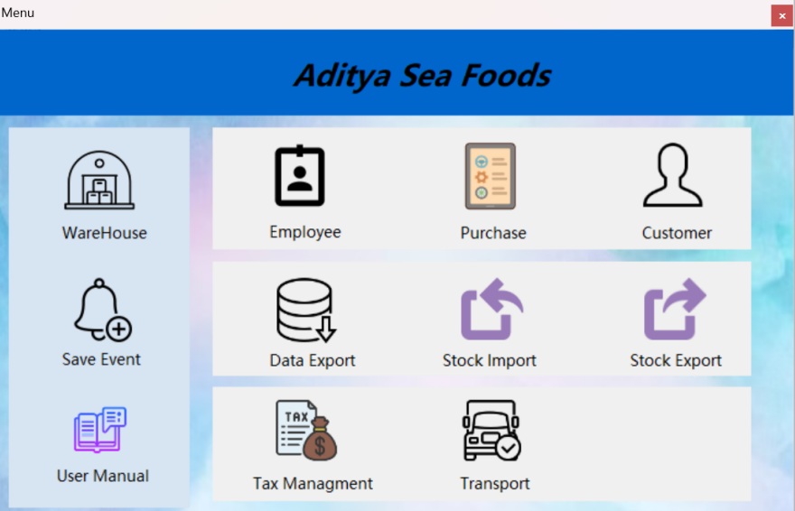

# Enterprise Inventory Management System

## 📌 Overview
A complete inventory management solution developed using **VB.NET** and **MSSQL**.  
The system automates and manages key business operations like employees, purchases, taxation, transport, and reporting.  

This project was developed as part of my academic work to demonstrate skills in **.NET application development, database design, and modular architecture**.

---

## ✨ Features
- **Employee Module** – Add, update, and manage employee details.  
- **Purchase Module** – Record supplier purchases and maintain stock.  
- **Customer Module** – Manage customer details and billing records.  
- **Stock Import Module** – Track product stock and inventory levels.  
- **Tax Management** – Apply and calculate GST or other applicable taxes.  
- **Transport Module** – Track product movement and logistics.  
- **Reports & Export** – Generate and export data for business insights.  

---

## 🛠️ Tech Stack
- **Frontend:** VB.NET (Windows Forms)  
- **Backend:** MySQL Database  
- **Architecture:** Modular, layered design  
- **Tools Used:** Visual Studio, MySQL Workbench  

---

## 📸 Screenshots
| Login Page | Menu |
|------------|-----------|
|  |  |

---

## 📖 Documentation
📄 [User Manual](User_Manual.pdf) – Includes usage guide, and module details.  

---

## 🚀 Future Scope
- Upgrade project to **ASP.NET Core (Web)** version.  
- Add **Role-based Access Control** for users.  
- Improve UI with modern design principles.  

---

## 👨‍💻 Author
**Lalit Dhake**  
📧 [lalitdhake01@gmail.com](mailto:lalitdhake01@gmail.com)  
